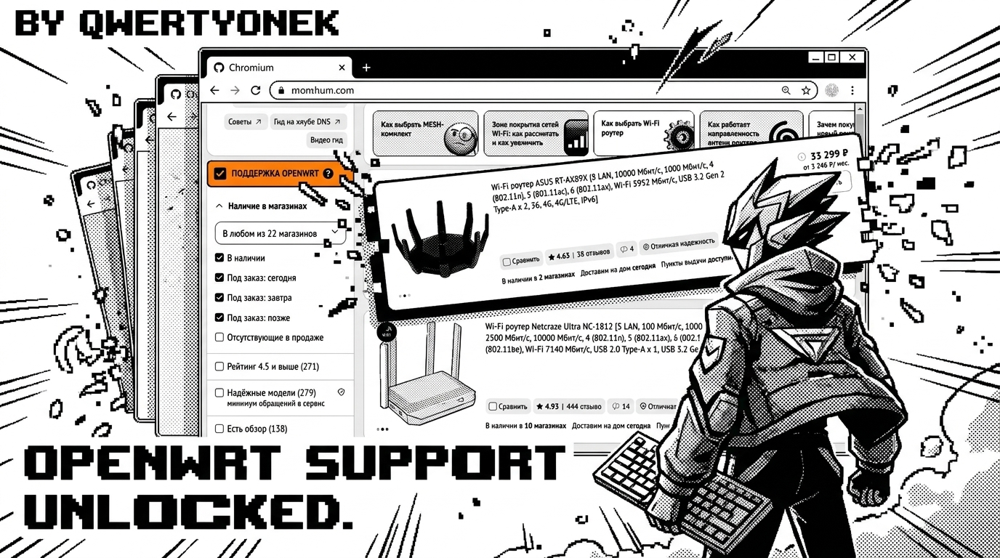

# 🛠️ DNS OpenWrt Filter



[](https://opensource.org/licenses/MIT)
[](https://github.com/qwertyonek/dns-openwrt-filter)
[](https://github.com/qwertyonek/dns-openwrt-filter/actions)
[](https://openwrt.org)

**DNS OpenWrt Filter** — это расширение для браузера, которое помогает найти роутеры с поддержкой OpenWrt в каталоге интернет-магазина DNS. Больше не нужно копировать название каждой модели и проверять её в Table of Hardware — расширение сделает это за вас прямо на странице магазина.

---

## 🚀 Основные возможности

- **Умная фильтрация:** Добавляет чекбокс "Поддержка OpenWrt" в боковую панель фильтров DNS.
- **Интеграция с Firmware Selector:** В каждой карточке товара появляется кнопка для быстрого перехода к прошивке.
- **Копирование в один клик:** При нажатии на кнопку название модели автоматически копируется в буфер обмена для вставки в OpenWrt Firmware Selector.
- **Оптимизированный движок:** Скрипт работает быстро, не тормозит страницу и учитывает динамическую подгрузку товаров при скролле.
- **Авто-обновление базы:** Вам не нужно ничего скачивать вручную. База поддерживаемых устройств обновляется автоматически каждую неделю через GitHub Actions.

---

## 🛠 Установка

Поскольку расширение находится в разработке, оно устанавливается в "режиме разработчика":

1.  **Скачайте проект:** Склонируйте репозиторий или скачайте архив [**dns-openwrt-filter.zip**](https://github.com/qwertyonek/dns-openwrt-filter/raw/main/dns-openwrt-filter.zip).
2.  **Распакуйте:** Если скачали ZIP, распакуйте его в удобную папку.
3.  **Откройте браузер:** Перейдите по адресу `chrome://extensions/` (или `edge://extensions/`).
4.  **Режим разработчика:** Включите тумблер **"Режим разработчика"** (Developer mode) в правом верхнем углу.
5.  **Загрузка:** Нажмите кнопку **"Загрузить распакованное расширение"** (Load unpacked) и выберите папку с файлами расширения.

---

## 📖 Как пользоваться

1. Зайдите в раздел [Wi-Fi роутеры](https://www.dns-shop.ru/catalog/17a8d2d216404e77/wi-fi-routery/) на сайте DNS.
2. В левой колонке фильтров активируйте чекбокс **"ПОДДЕРЖКА OPENWRT"**.
3. Список товаров обновится автоматически.
4. Нажмите **"В Selector (Копировать)"** на карточке нужного роутера. Вас перекинет на сайт OpenWrt, а модель уже будет в буфере обмена — просто нажмите `Ctrl+V`.

---

## 🛠 Для разработчиков

База поддерживаемых устройств хранится в `supported_devices.json`. Она обновляется автоматически раз в неделю по воскресеньям. Если вы хотите обновить её вручную:

1. Запустите Workflow в разделе **Actions** на GitHub.
2. Или запустите локально:
```bash
# Требуется toh.json
python3 process_data.py
```


---

## ☕ Поддержка проекта

Если расширение сэкономило вам время и помогло выбрать отличный роутер, вы можете поддержать автора.

> *Место для вашей ссылки на донаты (например, CloudTips или Buy Me a Coffee)*

---

## 📄 Лицензия

MIT License. Свободно для использования, модификации и распространения.

---
*Created with ❤️ for the OpenWrt community.*
